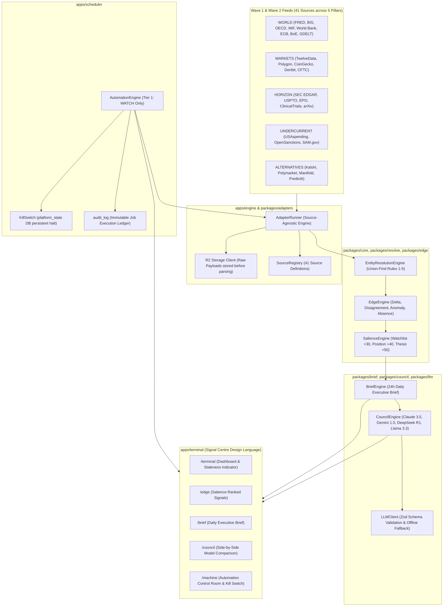

# MERIDIAN Platform Architecture & Production Operating Runbook

MERIDIAN is an institutional-grade macroeconomic intelligence, entity tracking, signal detection, and multi-model deliberation engine built on a TypeScript monorepo architecture.

---

## 1. System Topology & Component Overview



---

## 2. End-to-End Data Pipeline

1. **Ingest Phase**: `AdapterRunner` executes source adapters. Raw JSON payloads are saved to object storage (`r2://source/latest.json`) *before* parsing. Strict Zod boundary validation enforces non-null `licence_class`, `pillar`, `source_timestamp`, and `captured_at`.
2. **Resolve Phase**: Incoming records pass through `EntityResolutionEngine` using Union-Find rules (`RULE_1_CIK`, `RULE_2_LEI`, `RULE_3_ISIN`, `RULE_4_TICKER`, `RULE_5_COMPANIES_HOUSE`). Ambiguous matches queue to `MergeProposal`.
3. **Edge Phase**: `EdgeEngine` detects 4 signal types: `DELTA`, `DISAGREEMENT` (cross-source divergence), `ANOMALY` (> 3-sigma outlier), `ABSENCE` (SLA overrun). `SalienceEngine` weights signals against The Book.
4. **Brief Phase**: `BriefEngine` synthesizes observations into 4 dense sections (`What Changed`, `What Disagrees`, `Thesis Status`, `Standing Question Progress`). Enforces **100% statement citation provenance**.
5. **Council Phase**: `CouncilEngine` queries 4 LLMs simultaneously (Claude 3.5 Sonnet, Gemini 1.5 Pro, DeepSeek R1, Llama 3.3 70B), builds the **Disagreement Matrix**, calculates composite confidence, and synthesizes consensus.
6. **UI Phase**: Terminal UI (`apps/terminal`) renders dense data views enforcing mandatory `source` and `timestamp` badges via `Value`.

---

## 3. Platform Invariant Enforcement Matrix

| Invariant | Description | Enforcing Layer | Verification Gate |
| :--- | :--- | :--- | :--- |
| **Invariant 1: Provenance Enforcement** | UI components MUST render source & timestamp provenance. | `packages/ui/src/components/Value.tsx` | Gate 1 (`scripts/ci-gates.js`) |
| **Invariant 2: Engine Isolation** | `runner.ts` contains ZERO source-specific logic. | `apps/engine/src/runner.ts` | Gate 2 (`scripts/ci-gates.js`) |
| **Invariant 3: Thesis Falsification** | Every thesis MUST have non-empty `falsification_condition`. | `20260731000001_phase3_book_schema.sql` | Gate 3 (`scripts/ci-gates.js`) |
| **Invariant 4: Citation Completeness** | 100% of statements in briefs carry valid citations. | `packages/brief/src/index.ts` | Gate 4 (`scripts/ci-gates.js`) |
| **Invariant 5: Kill Switch Protection** | Kill switch halts all background scheduler jobs immediately. | `apps/scheduler/src/automation_engine.ts` | Gate 5 (`scripts/ci-gates.js`) |
| **Invariant 6: Money/Price Branding** | Money & prices use `bigint` scaled integers; raw floats prohibited. | `packages/core/src/money.ts` | Gate 6 (`scripts/ci-gates.js`) |

---

## 4. Production Operating Runbook

### Emergency Operations
1. **Activating The Kill Switch**:
   - Access `/machine` in `apps/terminal` and click **[EMERGENCY KILL SWITCH]**.
   - Or set DB state directly: `UPDATE platform_state SET kill_switch_active = TRUE WHERE id = 'MAIN';`.
   - Effect: All background cron triggers and scheduled jobs reject immediately.
2. **Checking Automation Audit Logs**:
   - Query `audit_log` table: `SELECT * FROM audit_log ORDER BY timestamp DESC LIMIT 50;`.

### Daily Production Verification
```bash
# 1. Run Verification Gates Suite (Must exit code 0)
node scripts/ci-gates.js

# 2. Run Full System E2E Rehearsal Pass
node --experimental-transform-types scripts/e2e_rehearsal.ts

# 3. Run Unit Test Suite across Workspace
node --experimental-transform-types --test packages/core/src/money.test.ts packages/registry/src/registry.test.ts apps/engine/src/runner.test.ts
```
